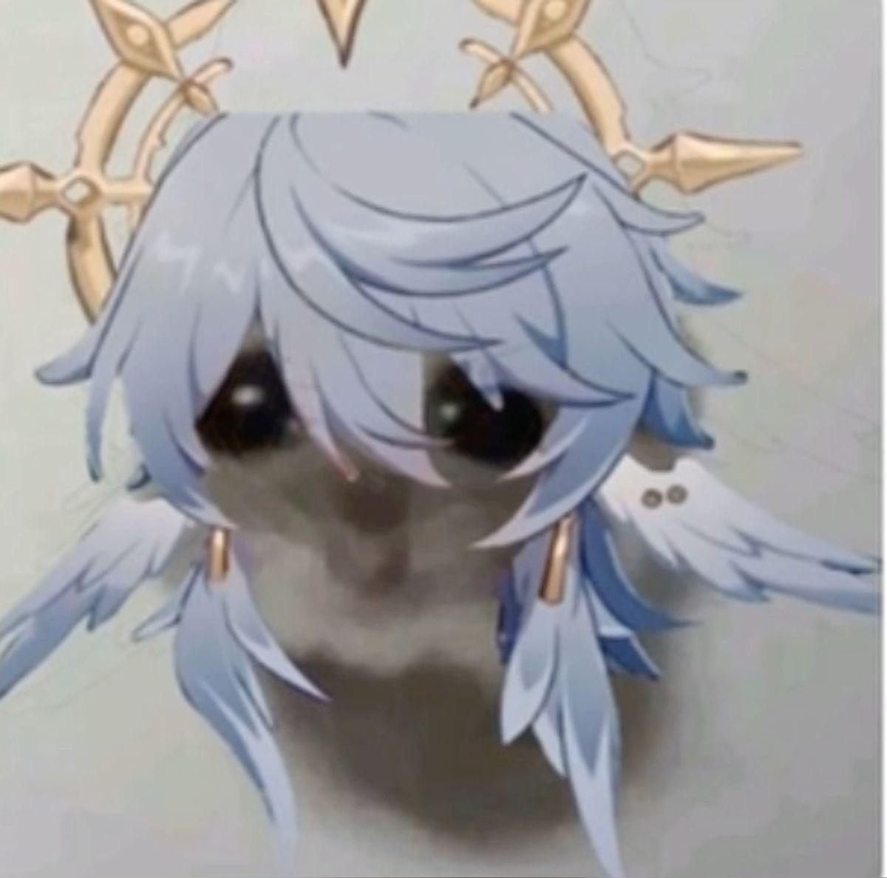

# Gamify

This is a fun little project to practice JS and to motivate progression in hobbies
 
The idea is to turn **a hobby** (for ex. running) into a **game** - it would have rewards and levels etc.
 
Give yourself a reward after each session or perhaps a week of steady progress
 

## Basic functionality of the application could be such as:

- Badges like _Novice Runner_, _Intermediate Runner_, _Master Runner_
- Ability to track the days when I went running to a calendar
- Maybe something like a gold star sparkly thingy as a reward
- Levels
- Track total hours used
- Practice combining HTML, CSS and JS together

---

Link to this repo: https://github.com/laanhema/gamify.git
 
Fast way to clone this thing:
 
`git clone https://github.com/laanhema/gamify.git`
 
_Markdown is cool woooooooow_ 😎
 

